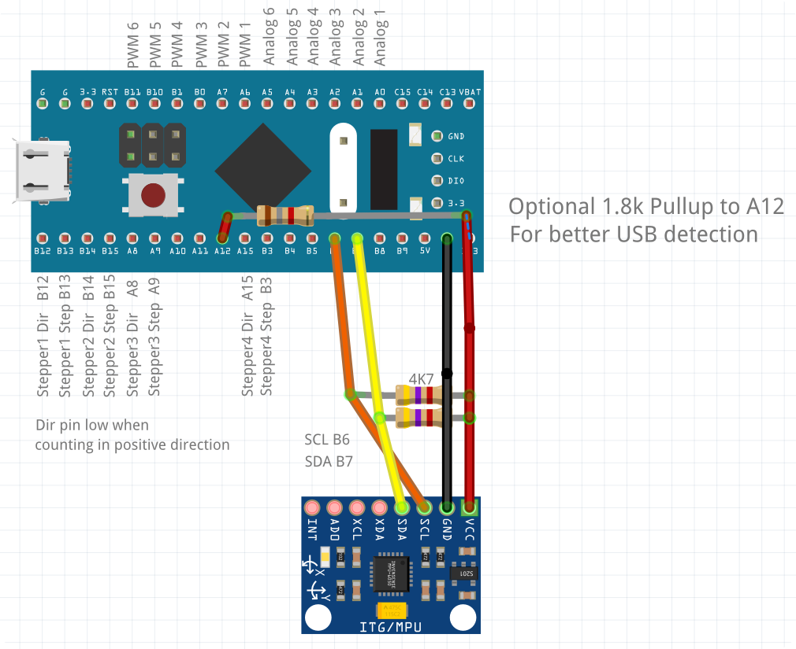
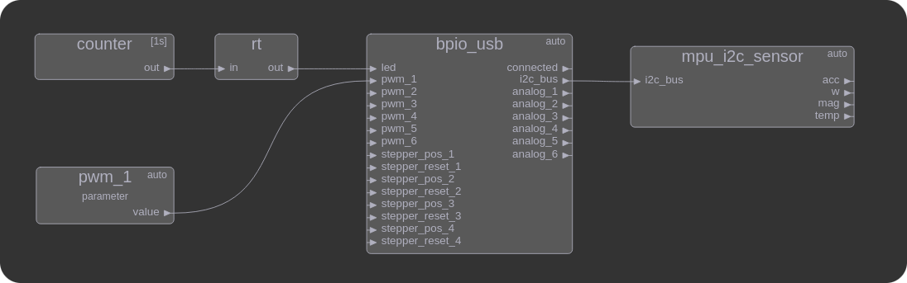

====
BPIO
====
BluePill IO adapter with ABMT-Node.

Flash precompiled firmware
==========================
- | Set outside juper to 1 and press reset. Call:
  | ``stm32flash -w firmware/release/bpio_fw_id0.bin -v -g 0x0 /dev/ttyUSB0``
  | PA9 -> RX-USB; PA10 -> TX-USB
  | Unlock device:

  - ``stm32flash -k /dev/ttyUSB0``

  - ``stm32flash -u /dev/ttyUSB0``

- or:

  - Get and install stlink utils from https://github.com/stlink-org/stlink

  - Unlock device: ``st-flash --reset write firmware/release/option_bytes_default.bin 0x1FFFF800``

  - Flash firmware ``st-flash write firmware/release/bpio_fw_id0.bin 0x8000000``

- or: ``pyocd load firmware/release/bpio_fw_id0.bin -f 4000000 -e chip -t stm32f103rc``
 
 
udev rules for all ID's
=======================
::

   SUBSYSTEM=="tty", ATTRS{idVendor}=="1f00", ATTRS{idProduct}=="2012", ATTRS{product} == "BPIO0", SYMLINK+="ttyBPIO0"
   SUBSYSTEM=="tty", ATTRS{idVendor}=="1f00", ATTRS{idProduct}=="2012", ATTRS{product} == "BPIO1", SYMLINK+="ttyBPIO1"
   SUBSYSTEM=="tty", ATTRS{idVendor}=="1f00", ATTRS{idProduct}=="2012", ATTRS{product} == "BPIO2", SYMLINK+="ttyBPIO2"
   SUBSYSTEM=="tty", ATTRS{idVendor}=="1f00", ATTRS{idProduct}=="2012", ATTRS{product} == "BPIO3", SYMLINK+="ttyBPIO3"
   SUBSYSTEM=="tty", ATTRS{idVendor}=="1f00", ATTRS{idProduct}=="2012", ATTRS{product} == "BPIO4", SYMLINK+="ttyBPIO4"

I2C
===
You can read max 128 Bytes per request (sizeof(i2c_response)).
Delay per request is around 2ms with steppers enabled and 1ms without.

PWM
===
Input is a float value form 0 to 1. Internaly the all PWM outputs have a resolution of 1024.
A prescaler can be configured to change the frequency. 
A prescaler of 0 results in a frequency of 72MHz/1024/( **0** + 1 ) -> 70.3kHz. 
A prescaler of 1 results in a pwm frequency of 72MHz/1024/( **1** +1) -> 35.2kHz.

Analog
======
Outputs a float value form 0 to 1.

Kown Issues
============
- Modemmanager blocks device -> uninstall usless deamon
- | BluePill cant be flashed.
  | Many new BluePills ar'e locked and the option bytes need to be changed to flash via st-link.
  | You can call 'flash_default_option_bytes.sh'
    (You may need a new version stlink from https://github.com/stlink-org/stlink.
    Debians current version is to old. "v1.7.0-201-g254a525" worked for me.
  | **Or you use stm32flash and flash via serial port instead of st-flash. Remove read an write protection with ``-k -u ``.**

- Many BluePills have a wrong (10k) pull up resistor at the USB-Port. In some
  cases this interrupts the detection when plugging in the device. Fix: Add a 1.8k resister from 3.3V to pin A12.
- I2C errors like not connected devices break stepper control.

Changes V1 -> V2
================
- 72Mhz instead of 48Mhz (PWM freq changes!)
- I2C pin change from B6/B7 to B8/B9
- Stepper4 moved from A15/B3 to C14/C5

Compile
=======

Install mbed
------------
- see https://os.mbed.com/docs/mbed-os/v6.15/build-tools/install-and-set-up.html
- pip install mbed-cli

Copy mbed-os
------------
- Download release https://os.mbed.com/mbed-os/releases/
- Move contained folder to 'mbed-os'

Compile
-------
mbed compile --target BLUE_PILL --toolchain GCC_ARM

