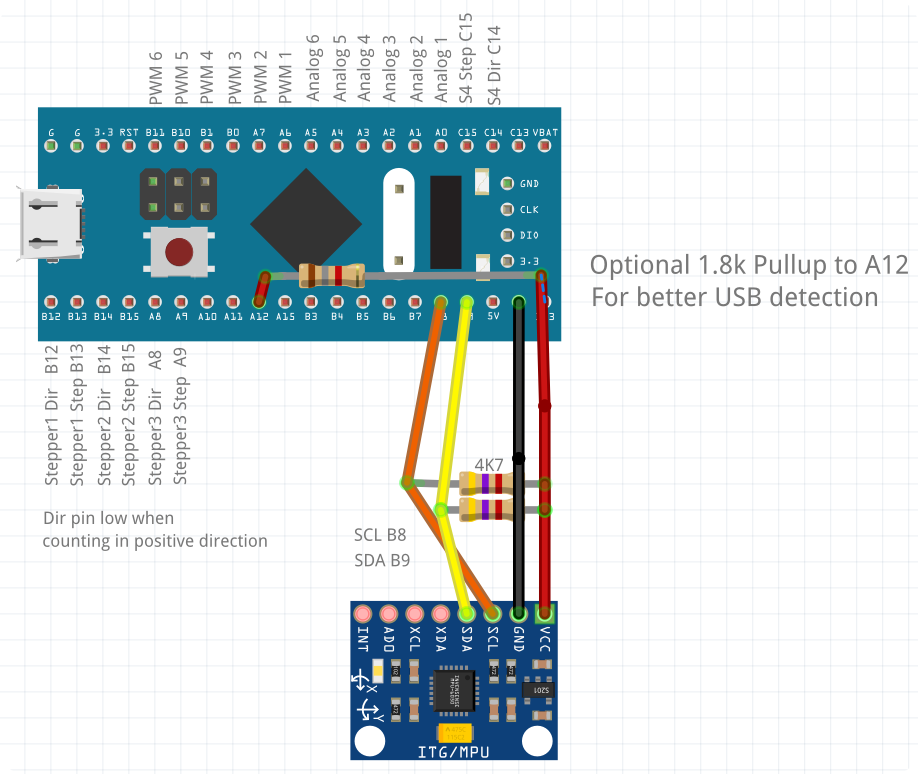

====
BPIO
====
BluePill IO adapter with ABMT-Node.

Install firmware
================
- Get and install stlink utils from https://github.com/stlink-org/stlink
- Unlock device: ``st-flash --reset write release/option_bytes_default.bin 0x1FFFF800``
- Flash firmware ``st-flash write release/bpio_fw_id0.bin 0x8000000``

PWM
===
Input is a float value form 0 to 1. Internaly the all PWM outputs have a resolution of 1024. A prescaler can be configured to change the frequency. A prescaler of 0 results in a frequency of 48MHz/1024/( **0** + 1 ) -> 46.9kHz. A prescaler of 1 results in a pwm frequency of 48MHz/1024/( **1** +1) -> 23.4kHz.

Analog
======
Outputs a float value form 0 to 1:

Kown Issues
===========
- Many BluePills have a wrong (10k) pull up resistor at the USB-Port. In some
  cases this interrupts the detection when plugging in the device. Fix: Add a 1.8k resister from 3.3V to pin A12.

Using muiltiple BPIO devices on one host
========================================
See readme in firmware folder. Basically you can flash another firmware that enumerates differently. When needing more than five, you have to compile the firmware yourself.
